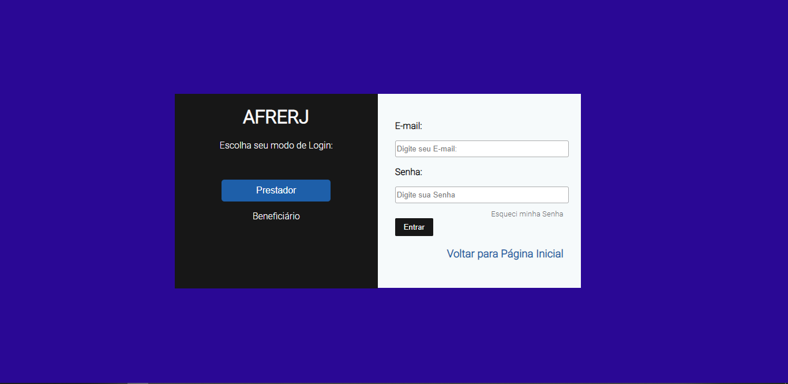

# Tela de login

Um site de login

## Demonstração do projeto

Foto do projeto

## Objetivo do projeto

Projeto desenvolvido para treinar HTML E CSS

## Tecnologias Usadas no projeto

Projeto feito utilizando as seguintes linguagens/tecnologias: 

* HTML
* CSS/FLEXBOX

## Instalação

Para que este projeto rode em sua máquina, siga os passos abaixo:

Clone este repositório em uma pasta em sua máquina  
$ git clone https://github.com/Leveditor/telaLogin.git

Entre na pasta  
$ cd telaLogin

